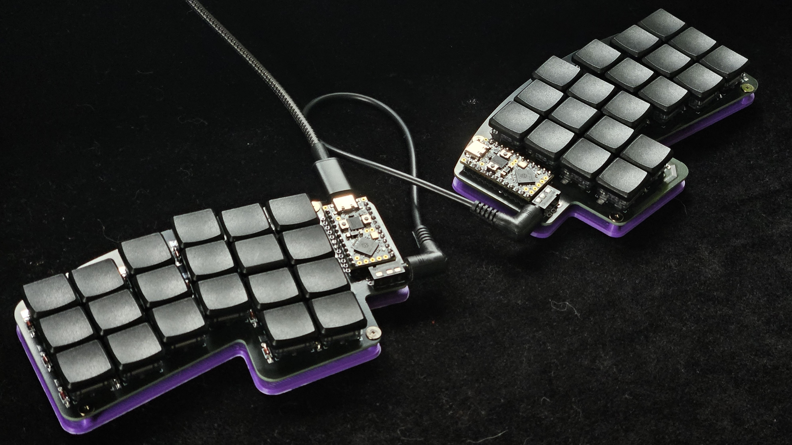
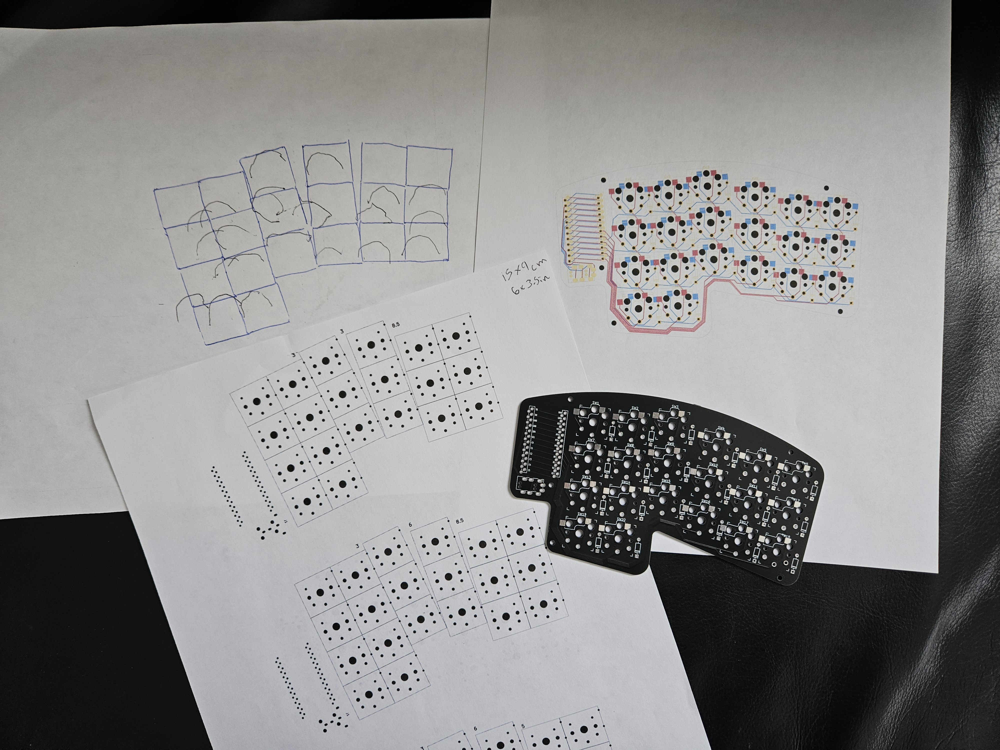

# keyboard
My fully custom split keyboard

## Features
- 40 key split layout
- dual rp2040 microcontrollers
- [kmk](http://kmkfw.io) firmware
- stenography layer for [plover](http://www.openstenoproject.org/)
- 3d printed base

## Background / design 
After years of wanting an ergonomic split keyboard but never seeing one that perfectly matched what I imagined in my mind, I decided to design and build my own!

I started completely from scratch by putting my hand on a sheet of paper and just seeing where my fingers liked to be. From there I made a layout based on where keys could actually go, and iterated until things really felt right.

I laid out the PCB according to this design, ordered all the parts, and anxiously waited to find out what I messed up. Since this was my first time designing a PCB, fist time programming a microcontroller, and first big soldering project, I 100% expected something to go wrong. To my surprise, everything went together perfectly and now I couldn't be happier with it.